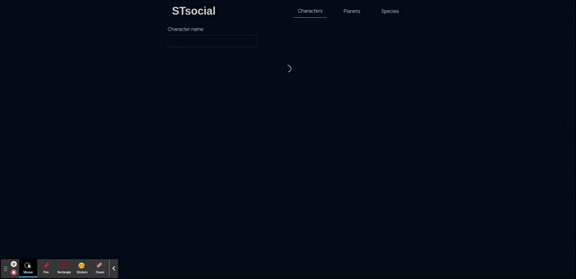

# Social Media for Star Wars characters

Challenge for https://github.com/bornlogic/frontend-interview_challenge

---

## Ingredients

- ReactJS
- Chakra-ui
- Styled Components

## Preview

## Challenge feature

Users can set an image to each person on Person's page. Images are encoded to base64 and saved in LocalStorage

